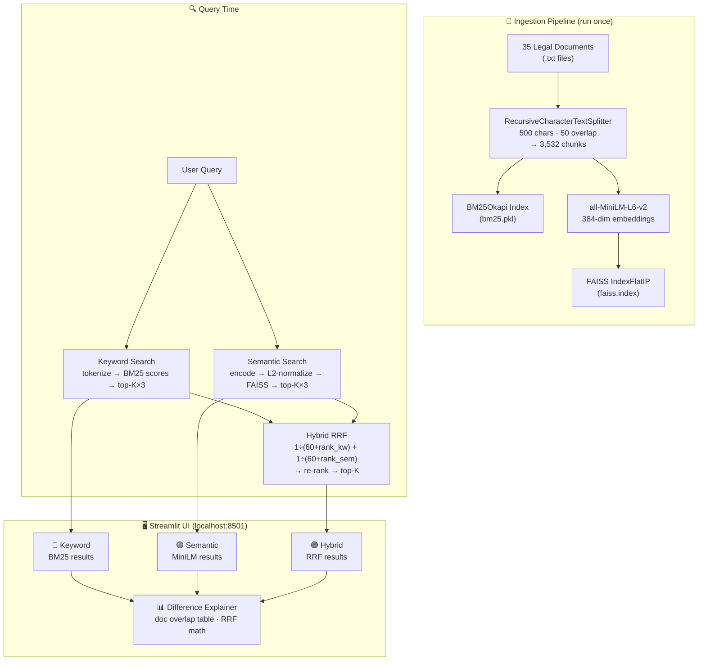
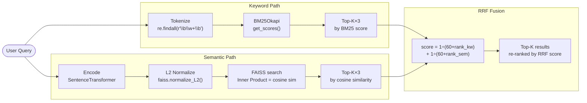
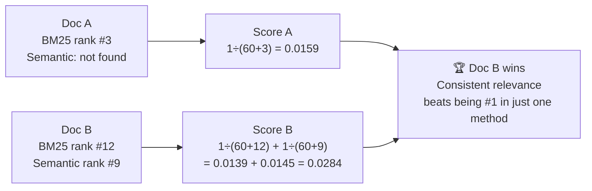

# AI-Powered Document Search Engine

A hybrid legal document search tool combining **BM25 keyword search** and **semantic vector search**, fused via **Reciprocal Rank Fusion (RRF)** — running fully locally with no paid APIs.

Built as part of the Trilegal take-home assignment.

---

## Features

- **3-mode search:** Keyword (BM25), Semantic (MiniLM), and Hybrid (RRF) displayed side-by-side
- **35 legal documents:** 20 commercial contracts + 15 Indian Supreme Court judgments
- **3,532 indexed chunks** — sub-second query time
- **Full document viewer** — click any result to read the complete document
- **Deduplication toggle** — one best result per document, or all matching chunks
- **Difference explainer** — shows exactly which documents each method found and why hybrid beats both

---

## Architecture

### System Overview



---

### Query Processing Pipeline



---

### RRF Score Intuition



---

## Tech Stack

| Component | Library | Why chosen |
|-----------|---------|-----------|
| **Chunking** | `langchain-text-splitters` `RecursiveCharacterTextSplitter` | Splits on paragraphs → sentences → characters in order; avoids mid-sentence cuts that hurt retrieval quality |
| **Keyword search** | `rank_bm25` (BM25Okapi) | Better than raw TF-IDF: saturates high-frequency terms, normalizes for document length. Industry standard for lexical retrieval |
| **Embeddings** | `sentence-transformers` `all-MiniLM-L6-v2` | 384-dim, ~80 MB, fully offline, ~60s CPU inference for all 3,532 chunks. No API key or cost |
| **Vector store** | `faiss-cpu` (IndexFlatIP) | Exact nearest-neighbor search; L2-normalized embeddings make inner product = cosine similarity. No approximation error at prototype scale |
| **Hybrid fusion** | Custom RRF | BM25 and cosine scores are on incompatible scales — normalization is fragile. RRF fuses ranks instead, requiring no calibration |
| **UI** | `streamlit` | `@st.cache_resource` loads all indexes once per session. `@st.dialog` for full-document modal. Zero frontend boilerplate |

---

## Document Corpus

| Category | Count | Source | Types |
|----------|-------|--------|-------|
| Commercial Contracts | 20 | CUAD v1 · `dvgodoy/CUAD_v1_Contract_Understanding_PDF` (HuggingFace) | Supply, franchise, software license, co-branding, manufacturing, distributor, service agreements |
| Indian SC Judgments | 15 | `rishiai/indian-court-judgements-and-its-summaries` (HuggingFace) | Income tax disputes, civil procedure, property law, limitation act |
| **Total** | **35** | | **3,532 indexed chunks** |

---

## Project Structure

```
AI-Powered Document Search Engine/
├── app/
│   ├── ingest.py           # One-time pipeline: load → chunk → BM25 → FAISS → save
│   ├── search.py           # LegalSearchEngine: keyword / semantic / hybrid methods
│   └── ui.py               # Streamlit frontend (3-column layout + dialogs)
├── data/
│   └── chunks.json         # 3,532 chunks: chunk_id, text, title, filename, doc_type, source
├── documents/              # 35 .txt files + metadata.json
├── indexes/
│   ├── bm25.pkl            # Pickled BM25Okapi with tokenized corpus
│   ├── faiss.index         # FAISS IndexFlatIP, 3,532 × 384 float32
│   └── embeddings.npy      # L2-normalized embedding matrix
├── .streamlit/
│   └── config.toml         # fileWatcherType=none (suppresses torchvision warnings)
├── collect_documents.py    # One-time downloader from HuggingFace datasets
├── requirements.txt
└── README.md
```

---

## Setup & Run

### Prerequisites

- Python 3.10+
- ~1 GB disk space (model weights + indexes)
- Internet access for first-time setup only (model download + HuggingFace datasets)

---

### Step 1 — Clone and create virtual environment

```bash
git clone <repo-url>
cd "AI-Powered Document Search Engine"

# Create virtual environment
python -m venv venv

# Activate — Windows
.\venv\Scripts\activate

# Activate — macOS / Linux
source venv/bin/activate
```

---

### Step 2 — Install dependencies

```bash
pip install -r requirements.txt
```

> First install downloads ~80 MB for the MiniLM model weights (cached after first run).

---

### Step 3 — Collect documents *(skip if `documents/` is already populated)*

```bash
python collect_documents.py
```

Downloads 35 legal documents from HuggingFace datasets. Takes ~2–5 minutes.

---

### Step 4 — Build indexes *(skip if `indexes/` is already populated)*

```bash
python app/ingest.py
```

Chunks all documents and builds BM25 + FAISS indexes. Takes ~2–3 minutes on CPU.

---

### Step 5 — Run the app

```bash
streamlit run app/ui.py
```

Open **http://localhost:8501** in your browser.

> **Note:** If you see torchvision warnings in the terminal, the `.streamlit/config.toml` already suppresses them — it won't affect search results.

---

## How Each Search Mode Works

### Keyword Search — BM25Okapi

BM25 is a probabilistic ranking function that scores documents by how well they match the query's exact tokens, accounting for:
- **Term frequency saturation** — repeated terms count less after a threshold
- **Inverse document frequency** — rare terms score higher than common ones
- **Document length normalization** — long documents don't automatically rank higher

```
query → tokenize → BM25Okapi.get_scores(tokens) → sort → top-K
```

Best for: exact legal terms, clause names, party names, specific words that must appear verbatim.

---

### Semantic Search — MiniLM + FAISS

`all-MiniLM-L6-v2` maps text to a 384-dimensional vector space where semantically similar texts are close together. FAISS with `IndexFlatIP` does exact cosine similarity search via L2-normalized inner product.

```
query → SentenceTransformer.encode() → faiss.normalize_L2() → IndexFlatIP.search() → top-K
```

Best for: conceptual queries, paraphrases, "what is this clause about" style questions.

---

### Hybrid Search — Reciprocal Rank Fusion

RRF combines ranked lists from both methods without needing to normalize their scores (which are on incompatible scales). A document that ranks consistently in both lists scores higher than one that dominates only one.

```
pool = max(top_k × 3, 50)  # wider candidate set
rrf_score = 1/(60 + rank_bm25) + 1/(60 + rank_semantic)
→ sort all candidates by rrf_score → top-K
```

The constant `k=60` is the standard from Cormack et al. (2009).

---

## Sample Queries

| Query | Keyword strength | Semantic strength |
|-------|-----------------|-------------------|
| `termination breach` | Finds chunks containing those exact words | Finds contract-ending clauses even if phrased as "early exit" or "dissolution" |
| `income tax deduction property` | SC judgments with those exact terms | Finds tax relief on real estate, even with different wording |
| `indemnification liability` | Exact indemnification clause text | Financial protection / risk allocation clauses |
| `when can a party exit without being liable` | Likely returns 0 results (no exact match) | Finds termination + no-penalty clauses semantically |
| `software license intellectual property` | License agreements containing those terms | IP ownership and protection clauses |

---

## Key Design Decisions

| Decision | Choice | Rationale |
|----------|--------|-----------|
| Chunk size | 500 chars | Granular enough for precise hits; large enough to carry clause context |
| Chunk overlap | 50 chars | Prevents clause text split across two chunks |
| RRF k constant | 60 | Standard default (Cormack et al., 2009); smooths rank differences |
| RRF pool size | `max(top_k × 3, 50)` | Enough candidates for RRF to promote consistently-relevant docs |
| FAISS index type | `IndexFlatIP` | Exact search — correct at 3,532 vectors; would use HNSW at millions |
| Deduplication | Best chunk per document | Same document appearing 5 times doesn't push out other documents |

---

## Assumptions & Limitations

### Assumptions
- Documents are in English; BM25 tokenization and MiniLM are optimized for English
- Chunk boundaries do not need to respect document section headers
- 500-char chunks carry sufficient context for retrieval without needing full documents
- 35 documents is representative for a prototype; same approach scales with better indexes

### Limitations

| Limitation | Impact | Fix at scale |
|-----------|--------|-------------|
| `IndexFlatIP` exact search | O(n) per query — fine at 3,532, slow at millions | Replace with FAISS HNSW or IVF index |
| No cross-encoder reranking | Retrieval precision limited to bi-encoder quality | Add `cross-encoder/ms-marco-MiniLM-L-6-v2` as reranker |
| No query expansion | "SC" not expanded to "Supreme Court" | Add abbreviation dictionary or LLM-based query expansion |
| Static index | Adding documents requires full `ingest.py` re-run | Switch to incremental FAISS + BM25 updates |
| General-purpose embeddings | `all-MiniLM-L6-v2` not fine-tuned on Indian legal text | Fine-tune on Indian SC judgments or use `legal-bert` |

---

## Requirements

```
streamlit>=1.35.0
sentence-transformers>=3.0.0
faiss-cpu>=1.8.0
rank-bm25>=0.2.2
langchain-text-splitters>=0.2.0
datasets>=2.20.0
numpy>=1.26.0
huggingface-hub>=0.23.0
torch>=2.0.0
transformers>=4.40.0
```
